# Zomato Restaurants Analysis

Welcome to the Zomato Restaurants Analysis repository! This project involves analyzing restaurant data from Zomato to derive meaningful insights and trends.

## Data

The dataset used in this project includes information such as:
- **Restaurant ID**: Unique identifier for each restaurant.
- **Restaurant Name**: Name of the restaurant.
- **Country Code**: Code representing the country where the restaurant is located.
- **City**: City where the restaurant is located.
- **Address**: Street address of the restaurant.
- **Locality**: Locality (neighborhood) of the restaurant.
- **Locality Verbose**: Detailed locality description.
- **Longitude**: Longitude coordinate of the restaurant's location.
- **Latitude**: Latitude coordinate of the restaurant's location.
- **Cuisines**: Types of cuisines offered by the restaurant.
- **Average Cost for two**: Average cost for two people dining at the restaurant.
- **Currency**: Currency used for pricing.
- **Has Table booking**: Whether the restaurant allows table booking (yes/no).
- **Has Online delivery**: Whether the restaurant offers online delivery (yes/no).
- **Is delivering now**: Whether the restaurant is currently delivering (yes/no).
- **Switch to order menu**: Option to switch to ordering menu (yes/no).
- **Price range**: Price range of the restaurant (1 to 4, with 1 being lowest and 4 being highest).
- **Aggregate rating**: Average rating given by users.
- **Rating color**: Color corresponding to the aggregate rating.
- **Rating text**: Text representation of the aggregate rating (e.g., Excellent, Good).
- **Votes**: Number of votes/ratings received from users.

### Data Source

The data is obtained from Zomato's API and publicly available datasets. Ensure you comply with Zomato's terms of use when using this data.

### Data Files

- `zomato.csv`: The main dataset containing restaurant details.
- `Country-Code.csv`: Has columns [Code ,Country].

# Zomato Restaurants Analysis

## Country Density

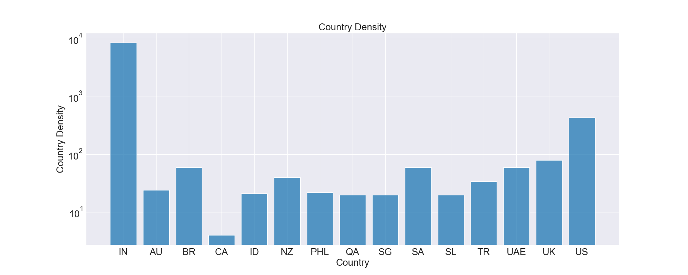

- The histogram shows the density of restaurants across different countries, with a logarithmic scale on the y-axis.

## Average Cost for Two

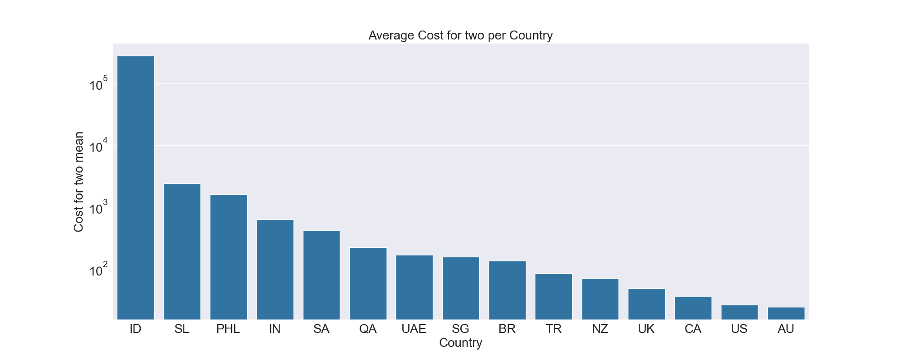

- Bar plot displaying the average cost for two people dining at restaurants in different countries, with a logarithmic scale on the y-axis.

## Average Price Range

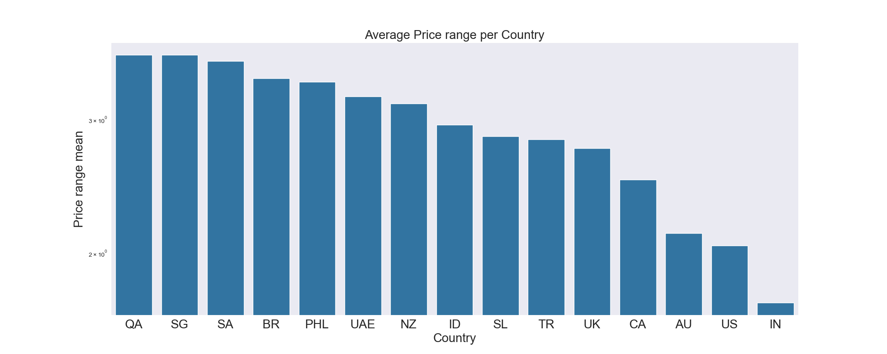

- Bar plot depicting the average price range of restaurants in different countries, with a logarithmic scale on the y-axis.

## Average Votes

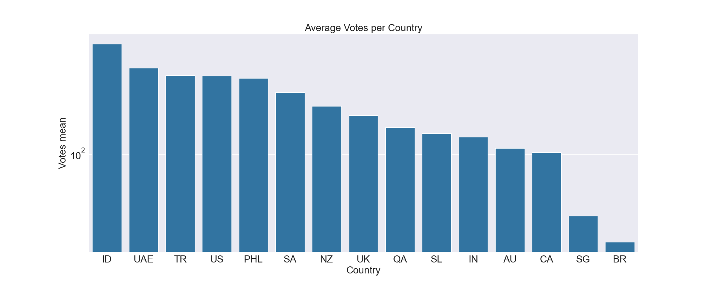

- Bar plot showing the average number of votes received by restaurants in different countries, with a logarithmic scale on the y-axis.

## Restaurant Count by Country and Aggregate Rating

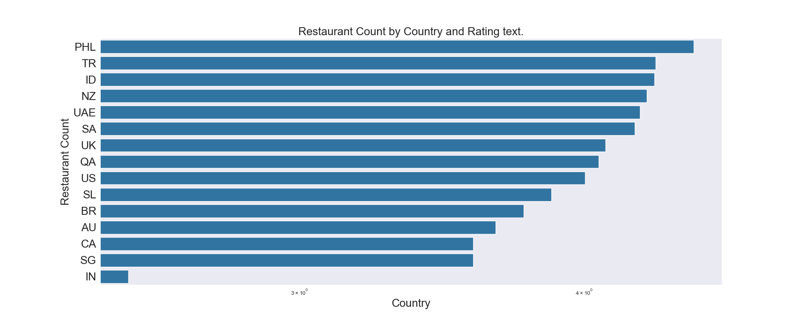

- Bar plot illustrating the count of restaurants by country and their aggregate rating, with a logarithmic scale on the x-axis.

## Restaurant Count by Country and Rating Text

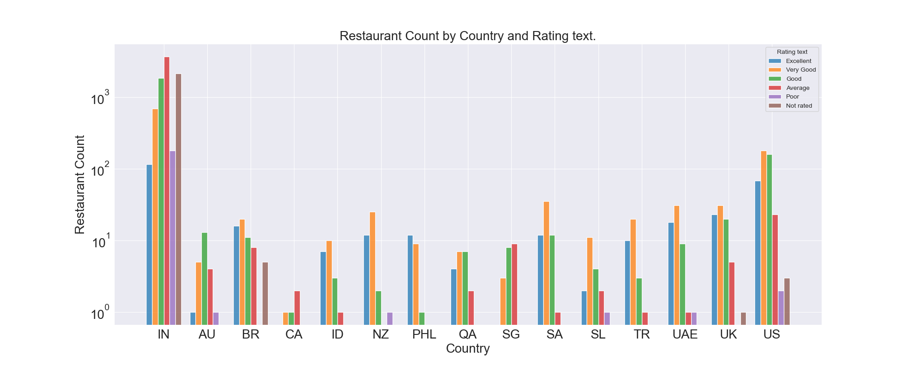

- Histogram showcasing the count of restaurants by country and their rating text, with a logarithmic scale on the y-axis.

## Percent of Restaurant Count by Country and Rating

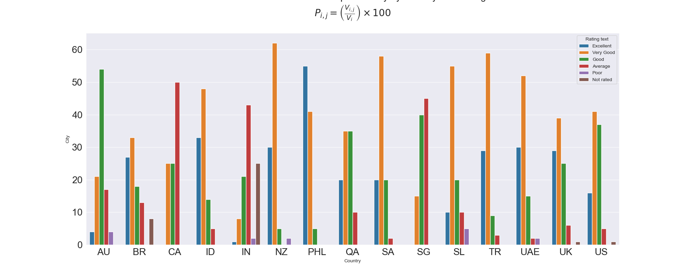

- Bar plot displaying the percentage of restaurant counts by country and their rating, calculated as a percentage of the total restaurant count per country.

## Restaurant Votes by Country and Rating Text

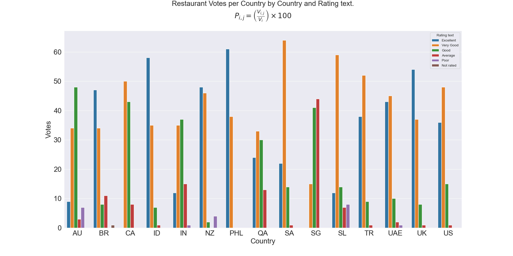

- Bar plot illustrating the percentage of restaurant votes by country and their rating text, calculated as a percentage of the total votes per country.

## Rating Color Density

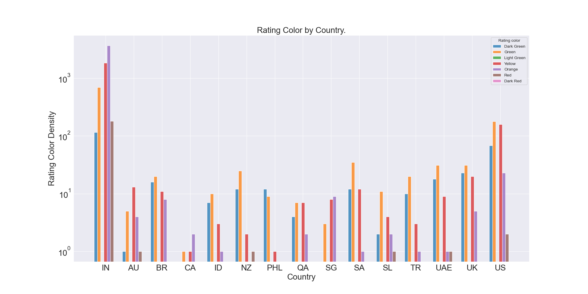

- Histogram displaying the density of rating colors assigned to restaurants across different countries, with a logarithmic scale on the y-axis.

## Restaurant Percentages by Country and Rating Color

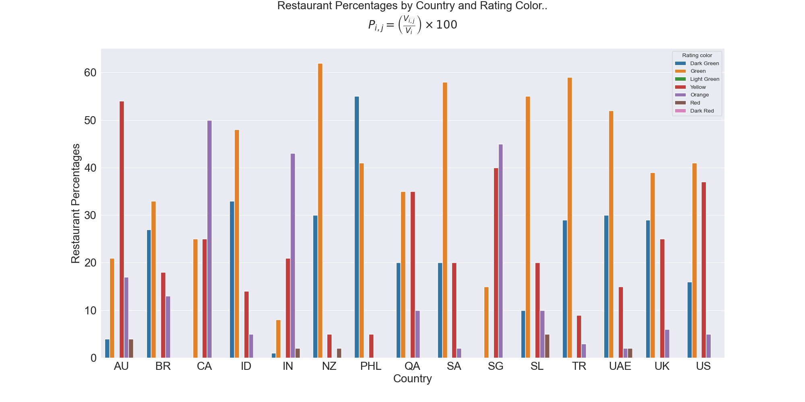

- Bar plot showing the percentages of restaurants by country and their rating color, calculated as a percentage of the total restaurant count per country.

## Restaurant Votes by Country and Rating Color

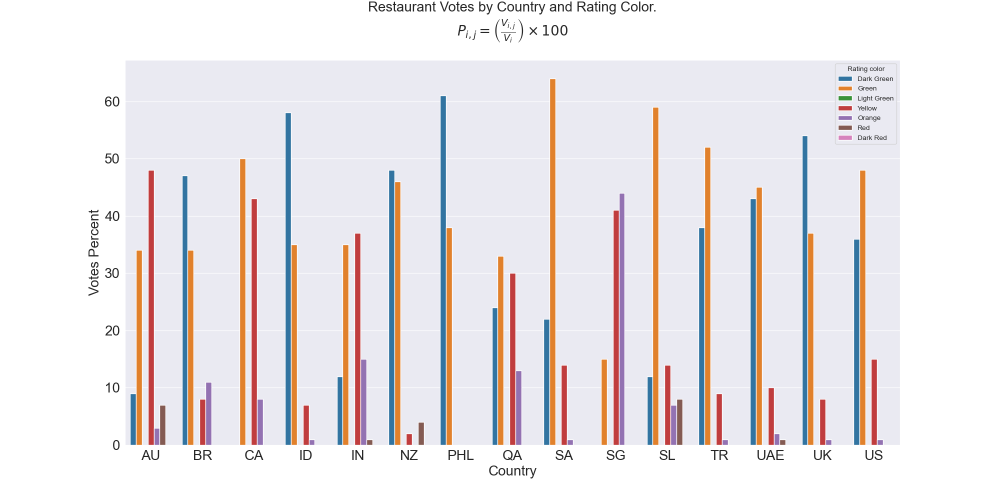

- Bar plot illustrating the percentages of restaurant votes by country and their rating color, calculated as a percentage of the total votes per country.

## Has Table Booking

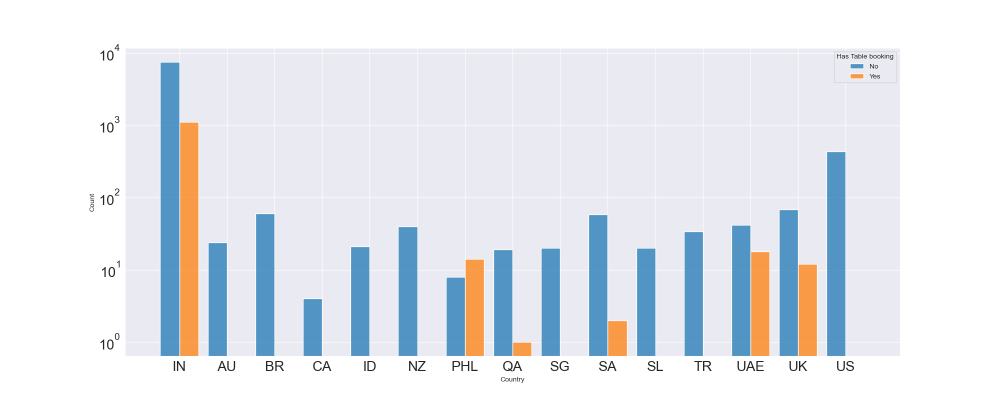

- Histogram showing the density of restaurants with and without table booking options across different countries, with a logarithmic scale on the y-axis.

## Has Online Delivery

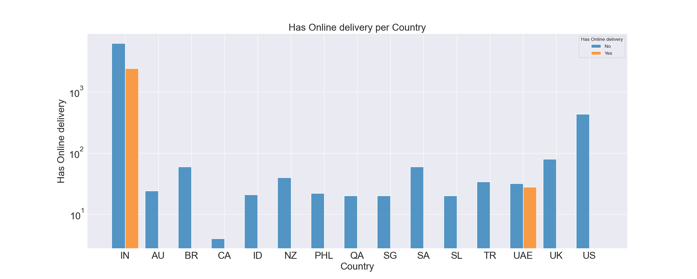

- Histogram depicting the density of restaurants with and without online delivery options across different countries, with a logarithmic scale on the y-axis.

## Top 10 Cuisines Density

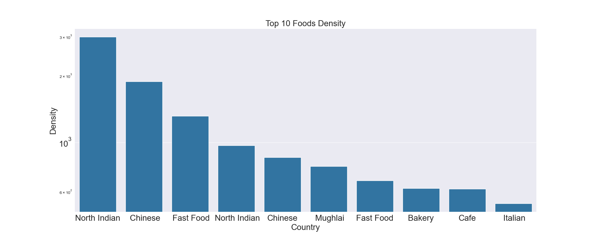

- Bar plot displaying the density of the top 10 most offered cuisines in restaurants across different countries, with a logarithmic scale on the y-axis.

## Top 10 Cuisines Density upon Restaurant per Country

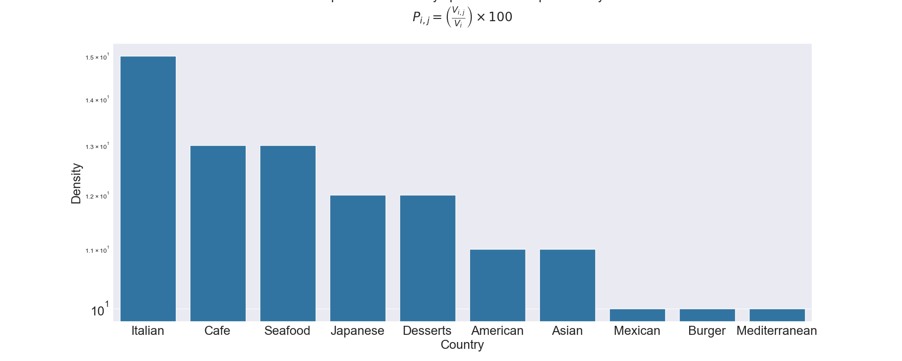

- Bar plot showing the density of the top 10 most offered cuisines in restaurants, specifically across different countries, calculated as a percentage of the total restaurant count per country.

## Top 5 Cuisines Density in Each Country

- The analysis below shows the top 5 cuisines by density in each country:

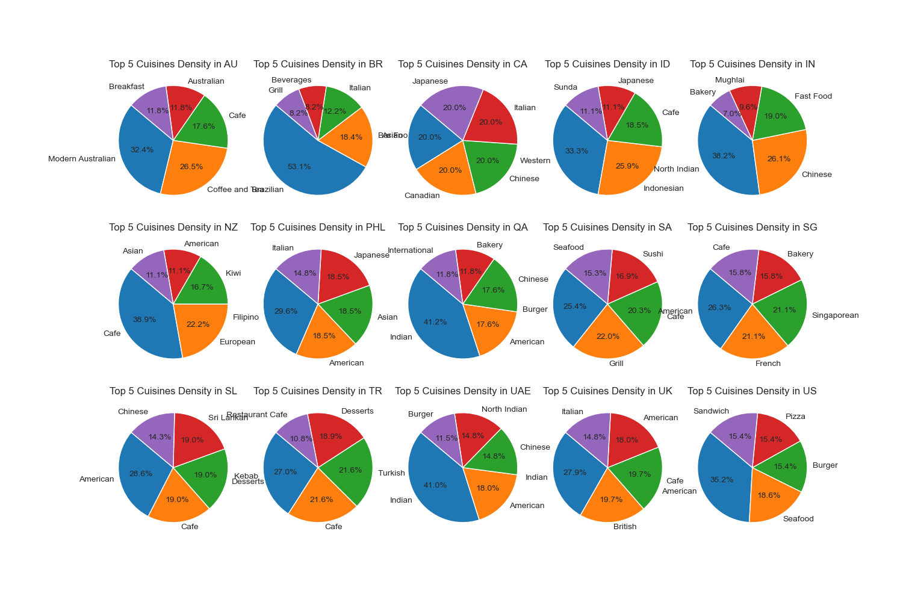

- This set of pie charts displays the density of the top 5 most offered cuisines in restaurants across different countries. Each chart represents a specific country, illustrating the percentage distribution of these cuisines.

## Top 5 Foods Density in Different Ratings

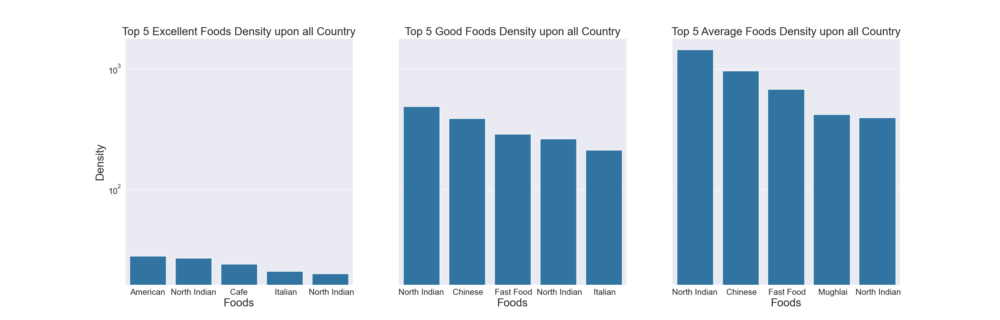

- The analysis is divided into three parts (Excellent, Good, and Average), each displaying the top 5 cuisines by density across different countries and rating categories.

